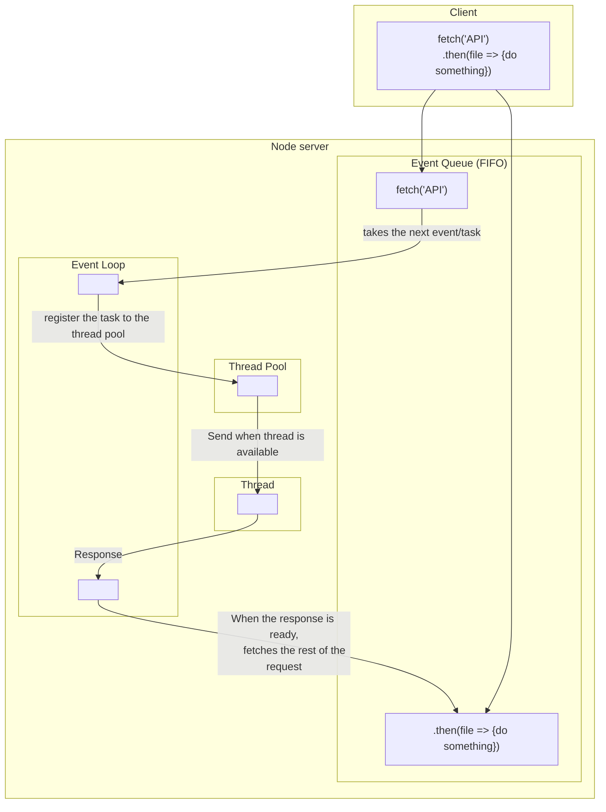

# Node JS
|            alias             |                  signification                  | ressources associées                      |
| :--------------------------: | :---------------------------------------------: | ----------------------------------------- |
|             RTA              |             Real Time Applications              |                                           |
|             SPA              |            Single Page Applications             | FrameWorks associés : Angular, Vue, React |
| Multithread // Single thread | capacité à faire plusieurs taches en même temps |                                           |
|   Blocking // Non-Blocking   | un système bloquant exécute les taches les unes après les autres. |                                           |
## What's NodeJS?

NodeJS is a **Non-Blocking** and **Single thread** JS server system. Specialy designed for hosting JS applications. 
A NodeJS server can stack requests in an **Event Queue**
The **Event Loop** create a list a callback requests in the **Thread Pool**.
Then the thread exécute them starting with the first request received (**FIFO** method)

### Good Stuff
NodeJS is good for managing big quantities of simple requests. 
Creating an event Queue alows the server to process requests One by One with the given ressources.
Other languages like PHP would allow more resosurces when more requests arive.
NodeJS do what it can, at it pase with the allowed ressources.
### Bad Stuff
It is however not so good for managing complicated requests.
If 5 Requests requiring 5 seconds of treatment each  are in the Event Queue, the alst one will wait for 25 seconds.

## Install Node JS
|                                         ressources                                          |
| :-----------------------------------------------------------------------------------------: |
|           [github](https://github.com/nvm-sh/nvm?tab=readme-ov-file#git-install)            |
|                  [définitions de base ](https://apprendre-a-coder.com/apprendre-node-js/)                   |
| [stucture et fonctionnement](https://www.data-transitionnumerique.com/nodejs-guide-complet/#h-node-js-c-est-quoi) |
|                                                                                             |

`cd ~/`

`git clone https://github.com/nvm-sh/nvm.git`

`cd ~/.nvm`

`git checkout v0.39.7`

`. ./nvm.sh`

`nvm install node`

`nvm install-latest-npm`

`node`

`mv .nvm .nvmrc`